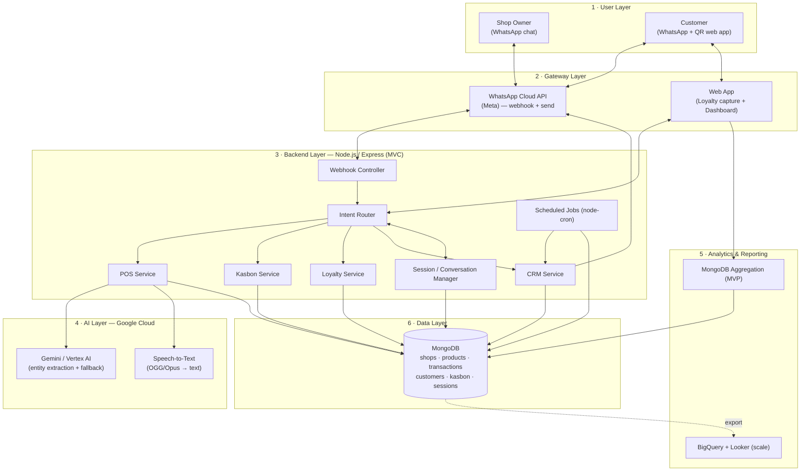
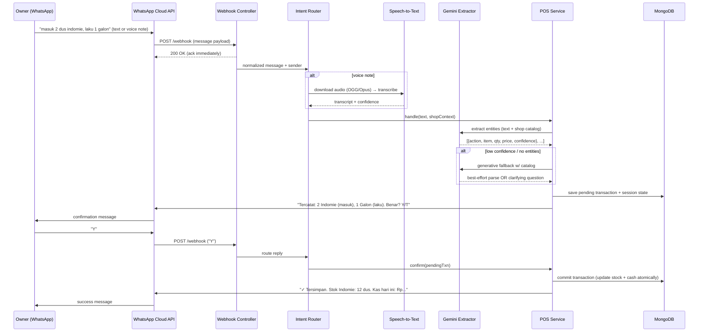
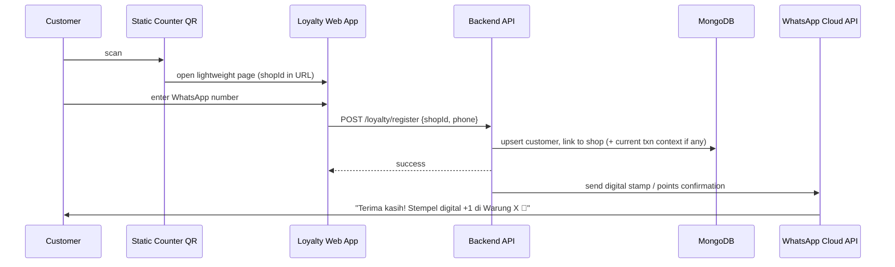
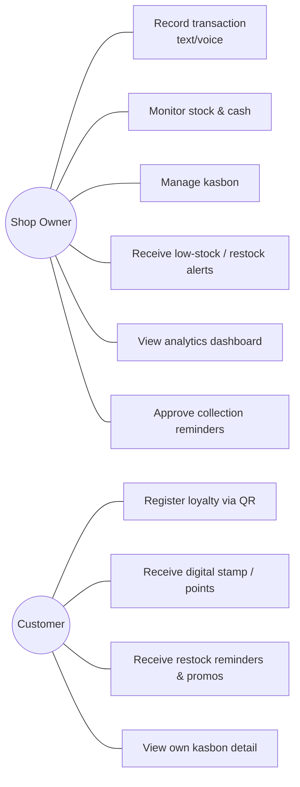
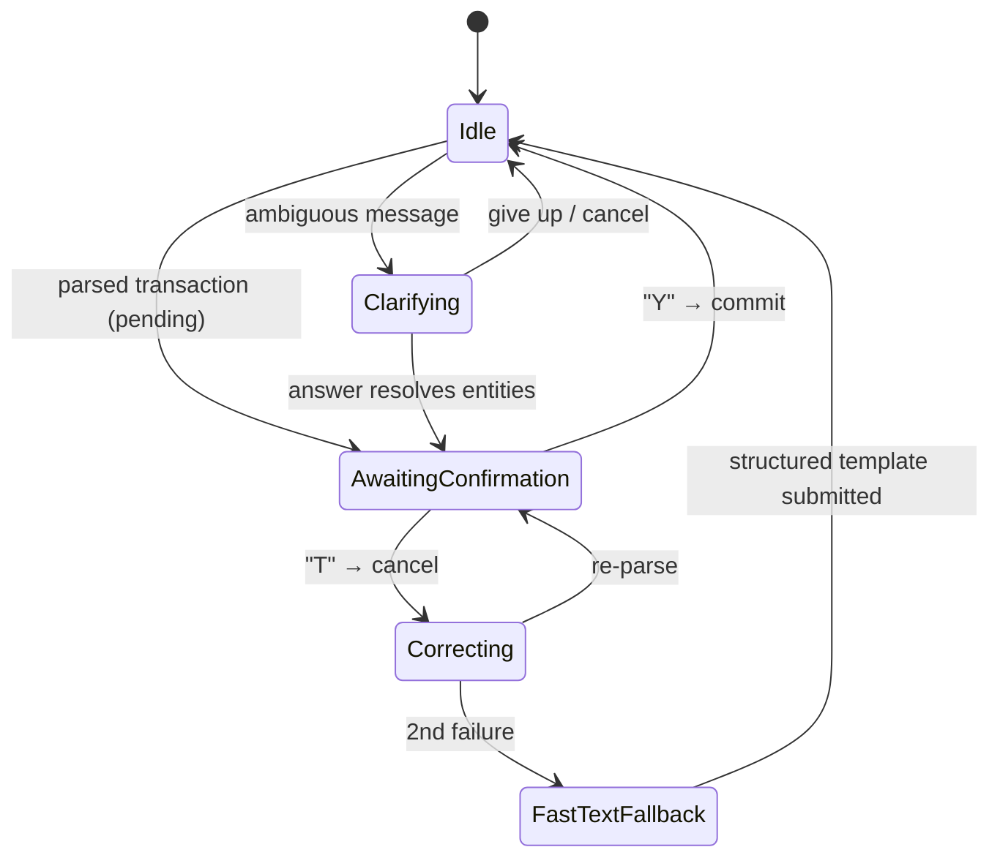

# Architecture — WarungAI

**Version:** 1.0 · **Last updated:** 2026-05-30

This document describes the system design. It complements [`PRD.md`](./PRD.md) (what) with
the how. Diagrams use [Mermaid](https://mermaid.js.org/) so they render on GitHub and stay
in version control as text.

---

## 1. Design principles

1. **WhatsApp is the UI.** All owner/customer interaction happens in chat or a tiny web app. No native app, ever.
2. **Hide complexity in the backend.** The owner sees a simple chat; the server orchestrates AI, DB, and scheduling.
3. **Human-in-the-loop for anything irreversible.** Money and debt are confirmed (Y/T) before persistence. (Risk R-01.)
4. **Stateless request handling, stateful conversation.** HTTP webhook handlers are stateless; conversational state lives in the DB (a per-user `session`), never in memory — the app must survive restarts and horizontal scaling.
5. **Cost isolation.** Expensive outbound WhatsApp messages (CRM/broadcast) are metered and gated separately from cheap inbound handling. (Monetization in [`PRD.md`](./PRD.md#5-monetization).)
6. **Graceful degradation.** Low STT/NLP confidence → fallback model → clarifying question → fast-text template. Never silently guess on money.
7. **MVP-pragmatic, production-aware.** Use the simplest thing that works for MVP (e.g. `node-cron`, MongoDB aggregation) but keep seams so the production component (Cloud Scheduler, BigQuery) drops in without a rewrite.

---

## 2. Layered architecture

Six logical layers (mirrors proposal §4.4):



### Layer responsibilities

| Layer | Responsibility | Tech |
|-------|----------------|------|
| **User** | Owners & customers interacting via chat / QR | WhatsApp, browser |
| **Gateway** | Inbound webhook + outbound send; static web app delivery | WhatsApp Cloud API, Express static / templates |
| **Backend** | Routing, intent classification, business logic (POS, kasbon, loyalty, CRM), conversation state, scheduling | Node.js + Express |
| **AI** | Voice→text; messy text→structured entities; ambiguous fallback | GCP Speech-to-Text, Gemini (Vertex AI) |
| **Analytics** | Owner dashboard metrics (MVP); regional aggregation (scale) | MongoDB aggregation → BigQuery/Looker |
| **Data** | Durable storage of all domain entities + conversation sessions | MongoDB (Mongoose) |

---

## 3. Component / module map

Prescribed source layout (see [`CONVENTIONS.md`](./CONVENTIONS.md) for the full tree):

```
src/
├── config/        env loading, db connect, GCP & WhatsApp client init
├── routes/        express route definitions (/webhook, /api, /loyalty)
├── controllers/   thin HTTP handlers — validate, delegate to services, respond fast
├── services/      business logic: posService, kasbonService, loyaltyService, crmService
├── ai/            sttClient, extractor (gemini), prompts/, schema validation
├── models/        mongoose schemas (Shop, Product, Transaction, Customer, Kasbon, Session)
├── jobs/          cron jobs: predictiveRestock, creditScoreRefresh, crmNotifier
├── messaging/     whatsapp send/receive wrappers, message templates, confirmation flow
├── intents/       intent router + classifier (POS vs kasbon vs loyalty vs help)
├── middleware/    webhook signature verify, rate/quota guards, tier gating
├── utils/         logger, money/qty parsing helpers, errors
└── app.js         express app wiring
web/
├── loyalty/       static QR landing page (phone capture)
└── dashboard/     owner analytics dashboard
server.js          process entrypoint (starts app + cron)
```

**Boundary rules (enforced in review):**
- Controllers **never** touch the DB directly — they call services.
- Services **never** parse HTTP/WhatsApp payloads — controllers/messaging normalize first.
- AI calls live only in `ai/` and `services/` that own that flow — never in controllers.
- Outbound WhatsApp sends go only through `messaging/` (so quota metering is centralized).

---

## 4. Key flows

### 4.1 Conversational POS (text or voice) — sequence



> After **2** failed confirmations the router switches the session to a fast-text template (Risk R-01).

### 4.2 Frictionless loyalty capture



### 4.3 Proactive CRM & predictive restock (nightly batch)

```mermaid
sequenceDiagram
    participant CRON as node-cron (nightly)
    participant JOB as Jobs
    participant DB as MongoDB
    participant Q as Quota Guard
    participant WA as WhatsApp Cloud API

    CRON->>JOB: trigger nightly batch
    JOB->>DB: read transaction history per shop/item/customer
    JOB->>JOB: predict stock-out & expiry (avg daily sales + seasonality)
    JOB->>JOB: refresh credit scores
    JOB->>JOB: RFM segmentation + restock-cycle prediction
    JOB->>DB: persist insights & flags
    JOB->>Q: check per-shop "Koin Bot" quota before any customer send
    alt quota available
        JOB->>WA: send restock reminders / segmented promos
    else quota exhausted
        JOB->>DB: queue / skip (notify owner low on credits)
    end
    Note over JOB,WA: Owner-facing low-stock alerts are not metered; customer broadcasts are.
```

### 4.4 Use-case overview



---

## 5. Conversational state machine

A per-user `Session` document tracks where each owner is in a multi-turn flow. The router
consults it before classifying intent.



Sessions must expire (e.g. TTL or `lastActivity` check) so an abandoned confirmation
doesn't trap the user. See [`DATA_MODEL.md`](./DATA_MODEL.md#session).

---

## 6. Data consistency rules

- **Transactions commit atomically.** A confirmed sale updates `product.stock` **and** appends to the cash ledger in one logical unit. Use a MongoDB transaction (replica set) or a carefully ordered single-document update where possible. Never leave stock decremented without a corresponding cash entry.
- **Pending ≠ committed.** Parsed-but-unconfirmed transactions carry `status: "pending"` and are excluded from all reports/aggregations.
- **Idempotency.** WhatsApp may redeliver webhooks; dedupe on the inbound `message.id`. Never double-apply a transaction.
- **Soft references by phone.** Customers are keyed by WhatsApp phone number (E.164). Kasbon and loyalty link by `customerId` once known, falling back to a name alias until the number is captured.

---

## 7. Reliability & operational concerns

| Concern | MVP approach |
|---------|--------------|
| Webhook must ack fast | Return `200` immediately, process asynchronously (queue/async handler) so Meta doesn't retry/timeout. |
| Webhook authenticity | Verify Meta's `X-Hub-Signature-256` HMAC on every inbound request. |
| Redelivery | Dedupe by `message.id`. |
| AI failure | Catch + fallback model + clarifying question; never 500 the webhook. |
| Secrets | All keys in env vars (`.env`, never committed). See [`TECH_STACK.md`](./TECH_STACK.md). |
| Logging | Structured logs with a request/correlation id; never log full message content with PII at info level in production. |
| Rate/quota | Centralized in `middleware/` + `messaging/`; daily POS cap (Free tier) and "Koin Bot" broadcast quota. |

---

## 8. Production evolution (post-MVP seams)

Keep these swappable behind interfaces so scaling doesn't require a rewrite:

| MVP | Production | Seam |
|-----|------------|------|
| `node-cron` | Cloud Scheduler → HTTP trigger | `jobs/` exposes callable functions; cron just invokes them |
| MongoDB aggregation | BigQuery + Looker | Stream/export transactions to BigQuery; dashboard reads from a reporting interface |
| Meta Cloud API direct | Official BSP | All sends go through `messaging/` adapter |
| Single instance | Horizontal scale | Stateless handlers + DB-backed sessions already enable this |
