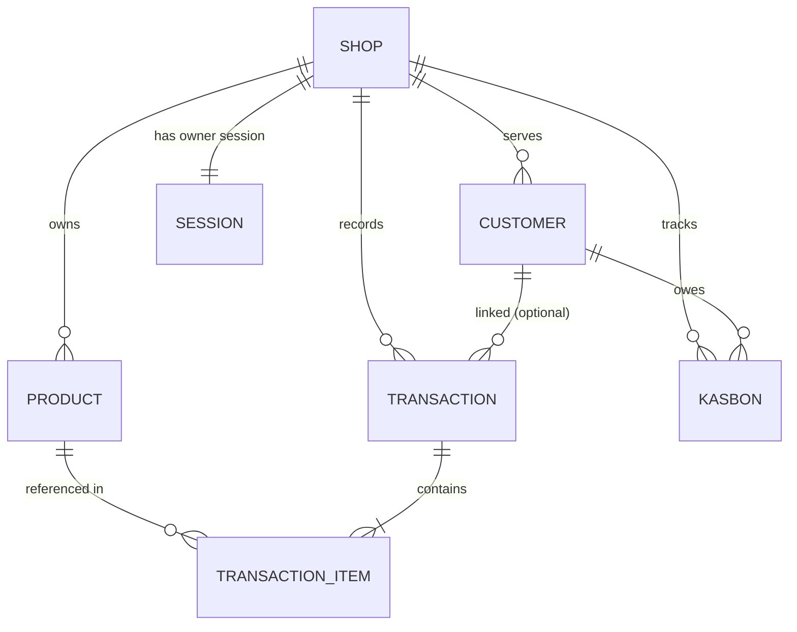

# Data Model — WarungAI

**Version:** 1.0 · **Last updated:** 2026-05-30 · **Database:** MongoDB (Mongoose)

This is the canonical schema reference. Mongoose models in `src/models/` must match these
shapes. Field names are `camelCase`. All timestamps use Mongoose `{ timestamps: true }`
(`createdAt`, `updatedAt`) unless noted.

> **Phone numbers** are stored in **E.164** (`+62812...`) and act as the soft key linking
> customers across collections.

---

## 1. Collection overview



| Collection | Purpose |
|------------|---------|
| `shops` | One per warung; owner identity, tier, quotas, settings |
| `products` | Per-shop inventory items + aliases for NLP resolution |
| `transactions` | Append log of stock-in / sale / expense; line items embedded |
| `customers` | Per-shop customer profiles, loyalty, RFM segment, credit score |
| `kasbons` | Debt records (open/settled) tied to a customer |
| `sessions` | Conversational state per owner (the state machine) |

---

## 2. Schemas

### Shop

```js
{
  _id: ObjectId,
  name: String,                  // "Warung Bu Sri"
  ownerPhone: String,            // E.164, unique — the WhatsApp number that controls the shop
  ownerName: String,
  tier: { type: String, enum: ["free", "premium"], default: "free" },
  settings: {
    locale: { type: String, default: "id-ID" },
    currency: { type: String, default: "IDR" },
    timezone: { type: String, default: "Asia/Jakarta" }
  },
  quotas: {
    dailyTxnCount: { type: Number, default: 0 },   // reset nightly
    dailyTxnDate: String,                          // "YYYY-MM-DD" the count applies to
    koinBotBalance: { type: Number, default: 0 }   // broadcast credits remaining
  },
  loyaltyQrSlug: String,         // unique slug embedded in the static QR URL
  createdAt, updatedAt
}
```
**Indexes:** unique on `ownerPhone`; unique on `loyaltyQrSlug`.

### Product

```js
{
  _id: ObjectId,
  shopId: ObjectId,              // ref Shop
  name: String,                  // canonical name, "Aqua 1500ml"
  aliases: [String],             // ["aqua botol gede", "aqua besar"] — feeds NLP resolution
  unit: String,                  // "pcs", "dus", "galon", "kg"
  stock: { type: Number, default: 0 },
  costPrice: Number,             // last known buy price (optional)
  sellPrice: Number,             // default sell price (optional)
  category: String,              // "minuman", "rokok", ...
  expiryDate: Date,              // for expiry warnings (optional / per-batch simplification)
  reorderPoint: Number,          // low-stock threshold (optional; predictive job can compute)
  isRoutine: { type: Boolean, default: false }, // gas, galon → drives customer restock reminders
  createdAt, updatedAt
}
```
**Indexes:** `{ shopId: 1, name: 1 }`; text index on `name` + `aliases` for fuzzy lookup.

### Transaction

Append-only log. A single owner message may produce multiple line items in one transaction.

```js
{
  _id: ObjectId,
  shopId: ObjectId,
  type: { type: String, enum: ["sale", "stock_in", "expense", "adjustment"] },
  status: { type: String, enum: ["pending", "committed", "cancelled"], default: "pending" },
  source: { type: String, enum: ["text", "voice"], default: "text" },
  rawMessage: String,            // original owner text / transcript (for audit + NLP retraining)
  whatsappMessageId: String,     // for idempotency / dedupe
  sttConfidence: Number,         // 0..1 when source = voice
  extractionConfidence: Number,  // 0..1 from the extractor
  items: [{
    productId: ObjectId,         // null until resolved/created
    name: String,                // resolved canonical or raw
    qty: Number,
    unit: String,
    unitPrice: Number,           // per-unit, IDR
    lineTotal: Number
  }],
  totalAmount: Number,           // sum of lineTotals (IDR)
  cashDelta: Number,             // +sale, -stock_in cost, etc. → feeds cash ledger
  customerId: ObjectId,          // optional link (loyalty / kasbon context)
  committedAt: Date,
  createdAt, updatedAt
}
```
**Indexes:** `{ shopId: 1, createdAt: -1 }`; unique sparse on `whatsappMessageId`; `{ shopId: 1, status: 1 }`.
**Rule:** only `status: "committed"` rows count in reports/aggregations.

### Customer

```js
{
  _id: ObjectId,
  shopId: ObjectId,
  phone: String,                 // E.164 (may be absent until loyalty capture)
  name: String,                  // or alias used by owner
  aliases: [String],
  loyalty: {
    points: { type: Number, default: 0 },
    stamps: { type: Number, default: 0 },
    joinedVia: { type: String, enum: ["qr", "manual"], default: "qr" }
  },
  rfm: {
    recencyDays: Number,         // days since last purchase
    frequency: Number,           // purchases in window
    monetary: Number,            // total spend in window
    segment: String              // "champion", "loyal", "at_risk", "new", ...
  },
  creditScore: {
    value: Number,               // computed risk score (see AI_INTEGRATION.md)
    band: { type: String, enum: ["good", "watch", "risky"], default: "good" },
    updatedAt: Date
  },
  restockPredictions: [{         // per routine item
    productId: ObjectId,
    avgCycleDays: Number,
    nextExpectedDate: Date,
    lastReminderAt: Date
  }],
  optInBroadcast: { type: Boolean, default: true }, // respect opt-out
  createdAt, updatedAt
}
```
**Indexes:** `{ shopId: 1, phone: 1 }` unique sparse; `{ shopId: 1, "rfm.segment": 1 }`.

### Kasbon (debt)

```js
{
  _id: ObjectId,
  shopId: ObjectId,
  customerId: ObjectId,
  status: { type: String, enum: ["open", "settled"], default: "open" },
  items: [{ name: String, qty: Number, unitPrice: Number, lineTotal: Number }],
  amount: Number,                // outstanding (IDR)
  originalAmount: Number,
  dueDate: Date,                 // optional
  payments: [{ amount: Number, paidAt: Date, note: String }],
  remindersSent: [{ sentAt: Date, channel: String, approvedByOwner: Boolean }],
  createdAt, updatedAt
}
```
**Indexes:** `{ shopId: 1, customerId: 1, status: 1 }`; `{ shopId: 1, status: 1, dueDate: 1 }`.
**Credit-score inputs** derive from this collection: total outstanding, days overdue, repayment frequency.

### Session (conversation state)

Backs the state machine in [`ARCHITECTURE.md`](./ARCHITECTURE.md#5-conversational-state-machine).
One active session per owner phone.

```js
{
  _id: ObjectId,
  shopId: ObjectId,
  ownerPhone: String,            // E.164
  state: {
    type: String,
    enum: ["idle", "awaiting_confirmation", "correcting", "clarifying", "fast_text_fallback"],
    default: "idle"
  },
  context: {
    pendingTransactionId: ObjectId, // the txn awaiting Y/T
    failureCount: { type: Number, default: 0 }, // → fast-text fallback after 2
    lastQuestion: String
  },
  lastActivityAt: Date,          // for TTL / stale expiry
  createdAt, updatedAt
}
```
**Indexes:** unique on `ownerPhone`; TTL index on `lastActivityAt` (e.g. 1h) **or** explicit staleness check in the router — pick one and document it. Expiring a stuck `awaiting_confirmation` returns the user to `idle`.

---

## 3. Sample documents

**Product**
```json
{
  "shopId": "665f...",
  "name": "Indomie Goreng",
  "aliases": ["indomie", "indomie goreng", "mie goreng"],
  "unit": "dus",
  "stock": 12,
  "sellPrice": 3000,
  "category": "makanan",
  "isRoutine": false
}
```

**Committed sale transaction** (from "laku 1 galon aqua")
```json
{
  "shopId": "665f...",
  "type": "sale",
  "status": "committed",
  "source": "text",
  "rawMessage": "laku 1 galon aqua",
  "items": [{ "name": "Aqua Galon 19L", "qty": 1, "unit": "galon", "unitPrice": 20000, "lineTotal": 20000 }],
  "totalAmount": 20000,
  "cashDelta": 20000,
  "committedAt": "2026-05-30T10:12:00+07:00"
}
```

---

## 4. Data-integrity rules (must enforce in services)

1. **Atomic commit** — committing a transaction updates `product.stock` and records `cashDelta` together; never partially. Use a MongoDB transaction (replica set) or guard with compensating logic.
2. **Pending exclusion** — aggregations/reports filter `status: "committed"` only.
3. **Idempotency** — reject/ignore a webhook whose `whatsappMessageId` already produced a transaction.
4. **Tier cap** — before committing on a `free` shop, check `quotas.dailyTxnCount < FREE_TIER_DAILY_TXN_CAP` (reset when `dailyTxnDate` rolls over).
5. **Broadcast quota** — before any metered customer send, decrement `quotas.koinBotBalance`; refuse at zero and notify the owner.
6. **Opt-out respected** — never broadcast to `customer.optInBroadcast === false`.
7. **Catalog growth** — if extraction references an unknown item, create a `Product` (stock 0) or prompt the owner to confirm — never silently drop the line.

---

## 5. Seeding & onboarding

A new shop needs a starter catalog. Define in Phase 2:
- On first contact, create the `Shop` + a `Session`, send a welcome flow.
- Catalog can be bootstrapped lazily: products are created as the owner records them (alias learning over time), or via a guided "list your top items" prompt.
- Generate a unique `loyaltyQrSlug` and the QR image/URL (`PUBLIC_BASE_URL/loyalty/:slug`).
