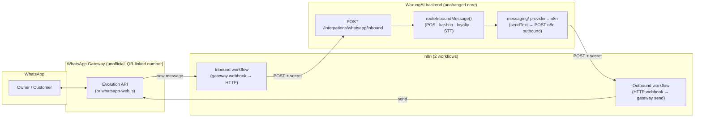

# n8n WhatsApp Integration — WarungAI

**Version:** 1.0 · **Last updated:** 2026-06-01 · **Status:** Planned (alternative transport)

This document describes routing WhatsApp through **n8n + a WhatsApp gateway** instead of
talking to the Meta Cloud API directly. It's the practical workaround for the Meta
restrictions we hit (error `130497` "Business account is restricted from messaging users in
this country", plus the Business Verification requirement).

> **It's an alternative transport, not a rewrite.** Per [`ARCHITECTURE.md`](./ARCHITECTURE.md),
> all WhatsApp I/O already goes through `src/messaging/`. n8n becomes a second **provider**
> behind a `WHATSAPP_PROVIDER` flag. The Cloud API path ([`WHATSAPP_INTEGRATION.md`](./WHATSAPP_INTEGRATION.md))
> stays intact for production / once verification is done.

---

## 1. Why n8n (and what it does/doesn't solve)

- ✅ **Sidesteps Meta verification + the +62 country block** — *if* paired with an unofficial gateway (a real WhatsApp number connected via QR). No WABA, no business verification.
- ✅ **No 24-hour window / no template approval** — those are Meta Cloud API rules; an unofficial gateway sends free-form messages anytime. This actually **simplifies Phase 7** (proactive CRM) — no template lead time.
- ✅ **Decouples transport from business logic** — n8n handles WhatsApp; WarungAI keeps its `routeInboundMessage` pipeline untouched.
- ⚠️ **Trade-off: unofficial gateways violate WhatsApp ToS → ban risk.** Use a **dedicated/spare number** (the "new card number" you mentioned), and **keep sends metered/throttled** (we already plan the Koin Bot quota — it matters even more here to avoid bans).
- ⚠️ **Not the production story.** Your proposal should still cite the official Cloud API / BSP as the scale path. n8n + gateway is for the MVP/demo.

> n8n alone does **not** bypass Meta — the *gateway choice* does. n8n's built-in "WhatsApp
> Business Cloud" node uses the same Meta API (same `130497`). To escape the restriction you
> must use an unofficial gateway (below).

---

## 2. Architecture



**Boundary rule:** WarungAI talks **only to n8n** (one inbound endpoint + one outbound
webhook). n8n talks to the gateway. This keeps a single integration seam.

---

## 3. Decisions to make first

| Decision | Options | Recommendation |
|----------|---------|----------------|
| **WhatsApp gateway** | **Evolution API** (self-host, free, QR, Baileys-based) · whatsapp-web.js (embed in n8n via community node) · Twilio WhatsApp (official-ish, paid) · Meta Cloud API node (❌ same `130497`) | **Evolution API** — most common with n8n, free, no verification, handles media/voice well |
| **n8n hosting** | Self-host via Docker (free) · n8n Cloud (paid, hosted) | **Self-host (Docker)** locally/with the gateway for the MVP |
| **Bot number** | A **dedicated/spare** WhatsApp number | Required — never your personal main number (ban risk) |
| **Integration style** | Async (n8n → our endpoint; we → n8n webhook) · Sync (reply in HTTP response) | **Async** — matches our fire-and-forget `sendText` and multi-message flows |

---

## 4. What you need — checklist

**Accounts / infra**
- [ ] A machine to run **n8n** + **Evolution API** (Docker; can be the same laptop for dev, or a small VPS for the demo).
- [ ] A **dedicated WhatsApp number** for the bot (the new SIM/card you mentioned) with WhatsApp installed, to scan the QR.
- [ ] A public URL for n8n's webhooks if the gateway/Meta-side needs to reach it (for a fully local setup, the gateway and n8n run side-by-side so it can be all-local).

**In n8n**
- [ ] **Inbound workflow:** gateway "message received" trigger → HTTP Request node → `POST {WARUNGAI}/integrations/whatsapp/inbound` with the shared secret header.
- [ ] **Outbound workflow:** Webhook node (the URL WarungAI calls) → gateway "send message" node.
- [ ] Credentials for the gateway (Evolution API base URL + API key) stored in n8n.

**In WarungAI (backend changes — built during Phase 7)**
- [ ] `WHATSAPP_PROVIDER=n8n` switch in config.
- [ ] New inbound route + controller: `POST /integrations/whatsapp/inbound` (verifies `N8N_INBOUND_SECRET`, normalizes → `routeInboundMessage`).
- [ ] New messaging provider `messaging/n8n.js`: `sendText` → `POST N8N_OUTBOUND_URL` with `N8N_OUTBOUND_SECRET`.
- [ ] Voice path: accept `audioBase64`/`audioUrl` from n8n → `Buffer` → existing `transcribeOggOpus` (the Meta-specific `media.js` is skipped in n8n mode).
- [ ] Dedupe by `messageId` (reuse existing `messageDedupeService`).

---

## 5. Environment variables (to add)

```dotenv
# --- WhatsApp transport selection ---
WHATSAPP_PROVIDER=n8n            # cloud | n8n   (default: cloud)

# --- n8n integration ---
N8N_INBOUND_SECRET=<random-string>   # n8n must send this header when calling our inbound endpoint
N8N_OUTBOUND_URL=https://<n8n-host>/webhook/warungai-send   # our backend POSTs replies here
N8N_OUTBOUND_SECRET=<random-string>  # we send this header; n8n verifies it
```

Validate these in `src/config/index.js` (only required when `WHATSAPP_PROVIDER=n8n`).

---

## 6. Data contracts

### 6.1 Inbound — n8n → WarungAI
`POST /integrations/whatsapp/inbound`
Header: `X-WarungAI-Secret: <N8N_INBOUND_SECRET>`
```jsonc
{
  "from": "6285363093316",          // sender phone (digits, no +)
  "messageId": "evo-abc123",         // unique id for idempotency/dedupe
  "type": "text",                    // "text" | "audio"
  "text": "masuk 2 dus indomie",     // present for text
  "audioBase64": null,               // present for voice (OGG/Opus base64), OR:
  "audioUrl": null,                  // a URL the backend can fetch
  "profileName": "Bu Sri",
  "timestamp": 1780000000
}
```
WarungAI normalizes this to the same internal shape used today
(`{ from: "+62…", messageId, type, text, audioMediaId|audio, profileName, timestamp }`)
and calls `routeInboundMessage`. Respond `200` immediately (ack), process async.

### 6.2 Outbound — WarungAI → n8n
`POST {N8N_OUTBOUND_URL}`
Header: `X-WarungAI-Secret: <N8N_OUTBOUND_SECRET>`
```jsonc
{ "to": "6285363093316", "type": "text", "text": "Tercatat: 2 dus Indomie (masuk). Benar? Balas Y / T" }
```
n8n's outbound workflow forwards this to the gateway's send-message node.

---

## 7. Setup steps (high level)

1. **Run the gateway + n8n** (Docker). Example services:
   - `evolution-api` (exposes a REST API + webhooks for WhatsApp)
   - `n8n` (workflow engine)
   - (Postgres/Redis as those images require)
2. **Connect the bot number:** in Evolution API, create an instance and **scan the QR** with the dedicated WhatsApp number. The number is now the bot.
3. **Point the gateway's "message received" webhook at n8n's inbound workflow.**
4. **Build the two n8n workflows** (§4). Add the shared-secret headers.
5. **Configure WarungAI:** set `WHATSAPP_PROVIDER=n8n` + the `N8N_*` vars, run the server (locally or wherever n8n can reach it).
6. **Test:** message the bot number from your phone → n8n → WarungAI → reply back. Same flows as today (onboard → POS → Y/T → voice → kasbon → loyalty).

> Exact Docker images / node names depend on the gateway version — fill those in when you
> stand it up. The contracts in §6 are what WarungAI commits to regardless of gateway.

---

## 8. Security

- **Both directions authenticated** with a shared secret header (`X-WarungAI-Secret`); reject mismatches with `403`. (HMAC over the body is even better — mirror `verifySignature.js`.)
- The inbound endpoint is a new public ingress — **rate-limit it** and **dedupe by `messageId`**.
- **Never log** the secrets or full message bodies/PII at info (per [`CONVENTIONS.md`](./CONVENTIONS.md)).
- Secrets in env only; never committed.

---

## 9. Phase 7 implications

- **Good news:** with an unofficial gateway there's **no template approval and no 24-hour window**, so proactive CRM sends (restock reminders, promos) are plain messages — removes the biggest Phase 7 blocker.
- **But:** mass/automated sends on an unofficial number are the #1 cause of bans. So the **Koin Bot quota + throttling** (already planned) is now a *safety* feature, not just monetization. Add small random delays between broadcast sends in the n8n outbound workflow.
- Owner-facing alerts and customer broadcasts still go through the same metered `messaging/` path.

---

## 10. Migration back to official Cloud API later

When you get the new card + complete Meta Business Verification:
1. Flip `WHATSAPP_PROVIDER=cloud`.
2. Fill the Meta creds (already documented in [`TECH_STACK.md`](./TECH_STACK.md) + [`WHATSAPP_INTEGRATION.md`](./WHATSAPP_INTEGRATION.md)).
3. Re-add message **templates** for out-of-window proactive sends.
No business-logic changes — only the transport provider + (re)introducing template rules.

---

## 11. Related docs
- [`WHATSAPP_INTEGRATION.md`](./WHATSAPP_INTEGRATION.md) — the official Meta Cloud API path (production target)
- [`ARCHITECTURE.md`](./ARCHITECTURE.md) — the `messaging/` adapter seam this plugs into
- [`PHASES.md`](./PHASES.md) — Phase 7 (where the n8n provider + inbound endpoint get built)
- [`MANUAL_TESTING.md`](./MANUAL_TESTING.md) — local testing (the `npm run sim` simulator still works regardless of transport)
