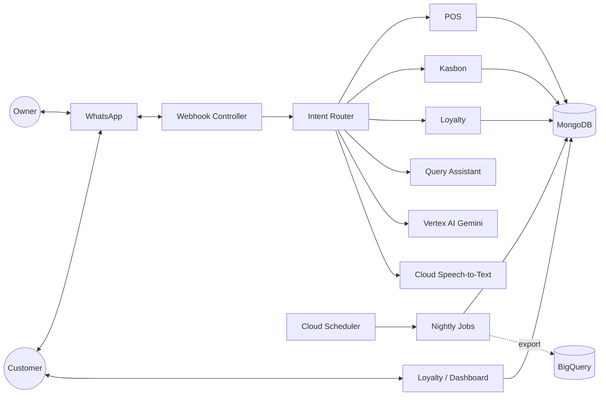

<div align="center">

# WarungAI

**AI-powered conversational POS & Smart CRM — running entirely inside WhatsApp.**

For the Indonesian *warung kelontong*: record stock, cash, and debt by sending a text or
voice note. No app to install, no menus to learn.

*Tim MOAS · Gunadarma Code Week 2.0*

</div>

---

## Overview

Indonesian *warung kelontong* (small grocery shops) handle **70%+ of daily FMCG transactions**,
yet their numbers have collapsed from **6.1M to 3.9M (2007–2025)**. The killer isn't price
competition with minimarkets — it's **undetected financial leakage**: lost/expired stock
(*shrinkage*) and uncollected informal credit (*kasbon*).

Conventional POS apps fail because tap-and-search is **slower than pen-and-paper** during rush
hour. The owner already lives in WhatsApp — so **WarungAI moves the entire operational interface
into WhatsApp** and removes all data-entry friction with AI.

> Owner sends `masuk 2 dus indomie, laku 1 galon aqua` -> AI extracts the line items -> owner
> confirms `Y` -> stock and cash update atomically. That's it.

---

## Features

| Feature | What it does |
|---------|--------------|
| **Conversational POS** | Record sales/stock by **text or voice note** in natural Indonesian. Every transaction is confirmed (`Y`/`T`) before it touches the books. |
| **Smart Kasbon & Credit Scoring** | Digital debt book with **deterministic** behavioral risk scoring and *owner-in-the-loop* reminders. Record payments with `bayar kasbon budi 50000`. |
| **Frictionless Loyalty** | Static QR -> customer opens WhatsApp with `DAFTAR` pre-filled -> registered. No typing, no app, verified number. |
| **Predictive Restock & Proactive CRM** | Nightly jobs predict stock-outs and rebuy cycles, segment customers (RFM), and surface who to remind. |
| **Reports & Free-form Q&A** | Daily/monthly recap, **net profit**, and ask anything: *"berapa untung hari ini?"*, *"barang apa yang perlu direstok?"* |
| **Analytics Dashboard + B2B** | Owner web dashboard (omzet, cash flow, top items, credit scoring) plus a **regional FMCG data** view for distributors. |

---

## How it works

```
Owner: laku 3 telur 6000
Bot:   Cek dulu ya:
       - 3 telur (laku Rp 6.000 @Rp 2.000)
       Benar? Balas Y / T
Owner: Y
Bot:   Tersimpan! Kas berubah Rp 6.000.

Owner: berapa untung hari ini?
Bot:   Laba bersih hari ini: Rp 145.000
       (omzet Rp 487.000 - modal Rp 342.000)
```

The owner experience is a normal WhatsApp chat. The complexity (AI, database, scheduling) is
hidden in the backend.

---

## Architecture



**Design principles:** WhatsApp is the UI; human-in-the-loop on money; all money/credit/restock
logic is **deterministic** (no LLM); the LLM only turns messy language into structured data;
the webhook always acks `200` fast and degrades gracefully.

---

## Tech Stack

**Powered by Google Cloud:**

| Service | Role |
|---------|------|
| **Vertex AI (Gemini)** | Entity extraction + free-form warung Q&A |
| **Cloud Speech-to-Text** | Voice-note transcription (`id-ID`) |
| **Cloud Scheduler** | Nightly batch (restock, credit refresh, CRM, export) |
| **BigQuery** | Regional FMCG analytics warehouse (B2B) |
| **Cloud Run** | Serverless hosting |

**Core:** Node.js 20 · Express · MongoDB (Mongoose) · WhatsApp Cloud API / n8n gateway ·
Zod · Pino · node-cron · Vitest · Chart.js + Bootstrap (dashboard).

---

## Getting Started

### Prerequisites
- Node.js **20+**
- MongoDB (local **or** MongoDB Atlas — needs a replica set for transactions)
- A Google Cloud project with **Vertex AI** + **Speech-to-Text** enabled (ADC via
  `gcloud auth application-default login`)

### Install & configure
```bash
git clone https://github.com/Hinsane5/WarungAI.git
cd WarungAI
npm install
cp .env.example .env   # then fill in the values
```
> AI auth: default is Gemini via **Vertex AI** (`GEMINI_USE_VERTEX=true` + ADC). Or set
> `GEMINI_USE_VERTEX=false` and provide a `GEMINI_API_KEY` (AI Studio).

### Run locally
```bash
npm run db:start     # start a local MongoDB replica set (separate terminal)
npm run db:init      # initialize the replica set
npm run seed         # seed a demo shop with catalog + sample data
npm run dev          # start the server (http://localhost:3000)
```

Test the flow **without WhatsApp** via the built-in chat simulator at
`/dashboard/chat?token=<dashboardToken>`, or replay a webhook:
```bash
npm run sim "masuk 2 dus indomie"
```

---

## Bot Commands

| Type | Does |
|------|------|
| `masuk 2 dus indomie 90000` | record stock-in |
| `laku 1 galon aqua 20000` | record a sale (`Y` to confirm, `T` to cancel) |
| `kasbon budi 2 rokok 50000` | record a debt |
| `bayar kasbon budi 50000` | reduce a customer's debt |
| `tagih budi` -> `KIRIM` | draft + send a debt reminder |
| `rekap sekarang` / `rekap bulanan` | daily / monthly report |
| `untung hari ini` / `untung bulan ini` | net profit |
| `semua produk` · `stok indomie` · `barang apa yang perlu direstok` | catalog / stock / restock |
| `qr loyalty` | get the customer-registration link |
| `/bantuan` | full command list |

Free-form questions also work (e.g. *"siapa yang masih punya kasbon?"*).

---

## Testing & Quality

```bash
npm test          # unit + integration tests (Vitest)
npm run lint      # ESLint
npm run format    # Prettier
```
Money-affecting logic (credit scoring, restock, RFM, profit) is unit-tested; AI extraction is
validated against labeled Indonesian fixtures.

---

## Deployment (Cloud Run)

```bash
gcloud run deploy warungai \
  --source . \
  --region asia-southeast2 \
  --set-env-vars "GEMINI_USE_VERTEX=true,BIGQUERY_ENABLED=true,..."
```
Nightly jobs run via **Cloud Scheduler** hitting `/jobs/run-nightly` (the same job functions are
callable directly, so the scheduler is just an HTTP trigger). See `DOCS/DEPLOYMENT.md`.

---

## Project Structure

```
src/
├── config/        env loading (Zod), db connect
├── routes/        express routes (/webhook, /api, /loyalty)
├── controllers/   thin HTTP handlers
├── services/      business logic (pos, kasbon, loyalty, crm, query, analytics…)
├── ai/            extractor (Gemini), sttClient, assistant, prompts/
├── models/        Mongoose schemas
├── jobs/          cron jobs (predictiveRestock, creditScoreRefresh, crmNotifier)
├── messaging/     WhatsApp send/receive (the only place that sends)
├── intents/       intent router
└── app.js
web/
├── loyalty/       QR phone-capture page
└── dashboard/     owner analytics + chat simulator
```

---

## Roadmap

- **Q4 2026:** QRIS payments in-bot, expansion to 500 warung
- **Q1 2027:** Group-buying (*kulakan bersama*), paid FMCG dashboard for principals, Looker Studio

Supports **SDG 8** (Decent Work) and **SDG 9** (Industry & Innovation).

---

## Team — MOAS

| Name | Role |
|------|------|
| Darris Felicio Hartanto | Hustler |
| Winsont Desvio Wu | Hustler |
| Nicholas Kenny Hendrawan | Hipster |
| Howard Frelindo Goh | Hacker |

---

## License

Released under the **MIT License**. Built for **Gunadarma Code Week 2.0**.
